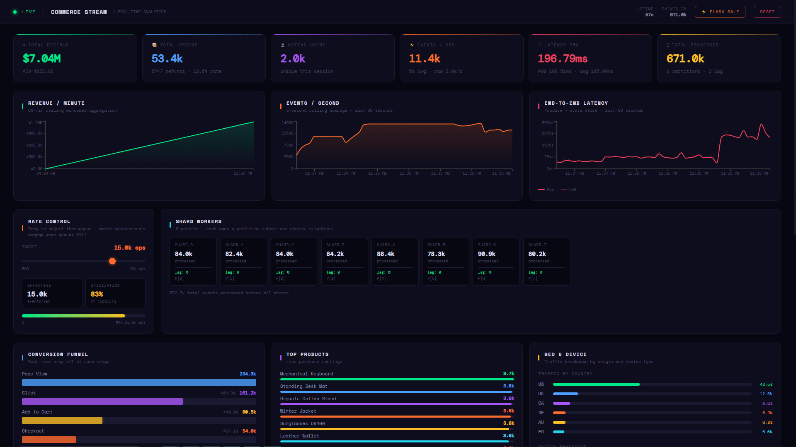

# Commerce Stream

I wanted to understand *how* Kafka and Flink actually work — not just how to use them. So I built the core ideas myself: a partitioned broker, shard-oriented workers, write-ahead logs, backpressure, and exactly-once delivery, all in Python with a live React dashboard. No managed services, no frameworks doing the hard parts — just the primitives.

**[Live Demo](https://commerce-stream.vercel.app)** · Built with Python / FastAPI / React




## Architecture

```
                   ┌─────────────────────────┐
                   │       FastAPI API        │
                   │  REST + WebSocket (1Hz)  │
                   └────────────┬────────────┘
                                │
                                ▼
                      ┌──────────────────┐
                      │  EngineRuntime   │
                      │ lifecycle · WAL  │
                      └────────┬─────────┘
                               │
              ┌────────────────┴──────────────────┐
              │                                   │
              ▼                                   ▼
     ┌─────────────────┐               ┌──────────────────┐
     │  EventSimulator │               │ StreamProcessor  │
     │  Poisson traffic│               │  8 shard workers │
     └────────┬────────┘               └────────┬─────────┘
              │                                  │
              ▼                                  │
     ┌─────────────────┐                         │
     │    Producer     │── hash(user_id) ──▶ ┌───┴──────────────┐
     └─────────────────┘                     │   8 Partitions   │
                                             │  queue + log     │
                                             └───────┬──────────┘
                                                     │
                                                     ▼
                                             ┌───────────────┐
                                             │   Pipeline    │
                                             │ filter·map·sink│
                                             └───────┬───────┘
                                                     │
                                                     ▼
                                             ┌───────────────┐
                                             │  StateStore   │
                                             │  WAL·snapshot │
                                             └───────────────┘
```

## Features

- **~10k events/sec** sustained throughput with stable latency in demo mode
- **Partitioned broker** with bounded queues enforcing backpressure when consumers fall behind
- **Shard-oriented workers** that own subsets of partitions and drain in batches
- **Flink-inspired pipeline** with composable `.filter()`, `.map()`, `.aggregate()`, and `.sink()` operators
- **Write-ahead log** with snapshot-based recovery — survives restarts without replaying the full log
- **Exactly-once delivery** via idempotent deduplication by event ID, persisted through WAL and snapshots
- **WAL compaction** and **partition log rotation** to keep disk usage bounded at runtime
- **Adaptive flash sale controller** that spikes traffic without destroying latency SLOs
- **Live React dashboard** with interactive rate control, shard worker telemetry, conversion funnel, geo distribution, latency percentiles, and partition health
- **Control plane / data plane separation** — FastAPI owns HTTP/WebSocket; EngineRuntime owns execution
- **44 async tests** covering the broker, producer, pipeline, state store, exactly-once semantics, WAL recovery, compaction, and log rotation

## Project Structure

```
commerce-stream/
├── api/
│   └── main.py                 FastAPI control plane — REST endpoints and WebSocket broadcaster
├── engine/
│   ├── config.py               EngineConfig dataclass — all parameters, loaded from environment
│   └── runtime.py              EngineRuntime — lifecycle, component wiring, compaction loop
├── broker/
│   ├── partition.py            Partition — bounded queue + append-only log + offset checkpointing
│   └── producer.py             Producer — hash-routes events across partitions, supports batch sends
├── processor/
│   ├── pipeline.py             Composable operator chain (filter / map / aggregate / sink)
│   ├── stream_processor.py     ShardWorker + StreamProcessor — batch draining and shard ownership
│   └── state_store.py          WAL-backed aggregation state — dedup, snapshots, compaction
├── simulator/
│   └── event_generator.py      Poisson-arrival simulator — sessions, flash sales, duplicate injection
├── dashboard/
│   └── src/App.jsx             React dashboard — WebSocket consumer, all charts and controls
├── tests/
│   ├── test_partition.py       Broker unit tests (produce, consume, replay, log rotation)
│   ├── test_producer.py        Routing and batch send tests
│   ├── test_pipeline.py        Operator chaining and process_batch tests
│   └── test_state_store.py     Aggregation, WAL recovery, exactly-once, compaction tests
├── Dockerfile
├── docker-compose.yml
├── requirements.txt
└── requirements-dev.txt
```

## Deployment

The backend and frontend deploy independently.

**Backend → [Render](https://render.com) (free tier)**

1. Connect the repo in Render's dashboard — it picks up `render.yaml` automatically.
2. The service starts on first deploy. Logs and checkpoints are written to the attached 1 GB disk.

**Frontend → [Vercel](https://vercel.com) (free tier)**

1. Import the repo in Vercel. It picks up `vercel.json` and runs `npm run build`.
2. Add one environment variable in the Vercel project settings:
   ```
   VITE_API_URL=https://<your-render-service>.onrender.com
   ```
3. Redeploy — the dashboard will connect to the live backend over WebSocket.

## Setup

### Backend

```bash
python3 -m venv venv
source venv/bin/activate
pip install -r requirements.txt
uvicorn api.main:app --reload --port 8000
```

### Frontend

```bash
cd dashboard
npm install
npm run dev
```

Dashboard: `http://localhost:3000`  
API: `http://localhost:8000`

### Docker

```bash
docker compose up
```

Starts both backend (port 8000) and frontend (port 3000).

### Tests

```bash
pip install -r requirements-dev.txt
pytest
```

## Engine Modes

Set via the `ENGINE_MODE` environment variable:

| Mode | Rate | Startup behavior |
|---|---|---|
| `demo` (default) | ~10k eps | Clears state on start, fast boot |
| `dev` | ~6k eps | Clears state on start |
| `stress` | ~12k eps | Clears state on start |
| `recovery` | ~8k eps | Restores from snapshot, replays WAL tail |

```bash
# Default
uvicorn api.main:app --reload --port 8000

# Recovery demo — shows fault tolerance
ENGINE_MODE=recovery uvicorn api.main:app --reload --port 8000

# High load
ENGINE_MODE=stress uvicorn api.main:app --reload --port 8000
```

All parameters are also individually overridable via environment variables (`ENGINE_NUM_PARTITIONS`, `ENGINE_SHARD_COUNT`, `ENGINE_BATCH_SIZE`, `ENGINE_WAL_COMPACT_INTERVAL`, `ENGINE_LOG_MAX_BYTES`, etc.).

## API Reference

| Method | Endpoint | Description |
|---|---|---|
| `GET` | `/engine/config` | Active configuration and runtime parameters |
| `GET` | `/metrics/snapshot` | Full metrics snapshot (state, broker, workers, simulator) |
| `GET` | `/metrics/broker` | Per-partition broker stats |
| `WS` | `/ws/live` | Live metrics stream pushed at 1 Hz |
| `POST` | `/simulator/flash-sale` | Trigger an adaptive traffic spike |
| `POST` | `/simulator/rate?rate=N` | Set simulator base rate |
| `POST` | `/system/reset` | Reset all state, queues, logs, and checkpoints |
| `GET` | `/replay/{partition_id}?from_offset=0` | Replay raw partition log entries |

## Design Notes

### Broker

Each partition is an independent unit composed of a bounded `asyncio.Queue` and an append-only log file. Events are routed by `MD5(user_id) % num_partitions`, which ensures consistent per-user ordering and even distribution. When a queue reaches capacity, the producer's `await queue.put()` naturally blocks — no explicit throttle or drop logic needed.

Partition logs are capped at 50 MB. When a log exceeds the cap, the oldest half of entries are discarded and `log_base_offset` is advanced so that `replay_from_offset()` always clamps requests to available data.

### Processing

Each `ShardWorker` owns one or more partitions and consumes from them in a tight batch loop. Events are passed through a `Pipeline` — a chain of composable operators — before reaching the `StateStore` sink. This mirrors Flink's DataStream model: data flows through operators, and the terminal sink is responsible for durability.

### Fault Tolerance

Every state mutation is written to the WAL before being applied in memory. On restart, the engine loads the last snapshot and replays only the WAL tail written since then. A background compaction task runs every 5 minutes: it saves a new snapshot and truncates the WAL, keeping both recovery time and disk usage bounded.

### Exactly-Once Delivery

The event simulator injects ~0.2% duplicate events to simulate producer retries (a realistic failure mode in distributed systems). The `StateStore` maintains a time-windowed dictionary of seen event IDs and drops any duplicate before touching aggregation state. The deduplication window survives restarts — event IDs are written to the WAL and restored from snapshots.
